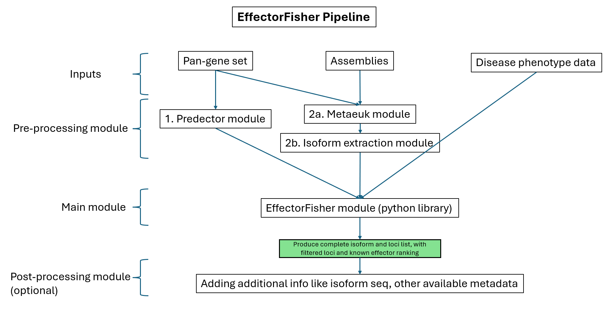

# EffectorFisher Pipeline

The EffectorFisher pipeline is designed to predict strong effector candidates by integrating disease phenotype data with currently available in-silico techniques. To run this complete pipeline, you are assumed to have the following data:

- Pan-gene set
- Assemblies
- Phenotype data for the isolates from a set of cultivars panel

## Pipeline Modules [Note: This repository mainly focuses on the details of the EffectorFisher module] 

The EffectorFisher pipeline consists of the following modules:

Preprocessing Module 1: Predector Module
   - Description: This module performs the initial preprocessing steps required for effector prediction. Predector runs numerous tools for fungal secretome and effector discovery analysis, and outputs a list of ranked candidates with effector-like characteristics (e.g. secreted, small etc).
   - Input: Pan-gene set
   - Output: `predector_results.txt` - preprocessed data for `EffectorFisher Module`

Preprocessing Module 2a: Metaeuk Module
   - Description: This module utilizes the Metaeuk tool for further preprocessing and analysis.
   - Input: Assemblies
   - Output: `*_prot.fas` and `*_codon.fas` output files for module `2b`

Preprocessing Module 2b: Isoform Extraction Module
   - Description: This module extracts isoform presence-absence profile from locus-specific protein fasta files and merged together.
   - Input: `*_prot.fas` output file from Preprocessing Module `2a`
   - Output: `combined_isoform.txt` - extracted isoform data for `EffectorFisher Module`



## EffectorFisher Module (Python Library)

The EffectorFisher module is a Python library used for analyzing effector proteins to identify strong effector candidates. It focuses on inferring S-gene interactions or associations between candidate effector genes and host cultivars, which are identified via disease phenotyping panels. The module also takes into account other effector-like characteristics to refine the candidate list.

### Input Files
To run this module, you need to provide the following input files:

1. `combined_isoform.txt`: This file is the output of mudule `2b`. It should be located in the directory where the isoform pipeline was executed.

2. `phenotype_data_quantitative.txt` or `phenotype_data_qualitative.txt`:
   - `phenotype_data_quantitative.txt`: This file should contain numeric disease scores. You need to prepare this file as shown in the example.
   - `phenotype_data_qualitative.txt`: This file should contain disease severity levels (high or low). You need to prepare this file as shown in the example.

3. `predector_results.txt`: This file will be found after running the predector pipeline, i.e. module.

4. `known_effector.txt` (optional): You can provide known effector IDs and names in this file, as shown in the example. If this file is not provided, the module will not include known effector ranking in the final output.

**Important:** Make sure your input file names are the same as mentioned above and that they are located in the subdirectory `00_input_files` within your working directory. Alternatively, you can provide the input file paths as command-line arguments (note: still working on it).

### Directory Structure
Here's an example of the directory structure for running the EffectorFisher module:

```plaintext
working_directory/
├── 00_input_files/
│   ├── combined_isoform.txt
│   ├── phenotype_data_quantitative.txt (or phenotype_data_qualitative.txt)
│   ├── predector_results.txt
│   └── known_effector.txt (optional)
├── effectorfisher_module.py
└── ...
```

Make sure to place the input files in the `00_input_files` directory within your working directory. The `effector_fisher_module.py` file should be located in the root of your working directory.

### Usage
To run the EffectorFisher module, execute the following command:

```
python effectorfisher_pipeline.py --data_type <data_type> [options]
```

### Options

**Must include:**
- `--data_type <data_type>`: Specify the type of phenotypic data you have. Choose either `qualitative` or `quantitative`. See the examples in the `input_files` directory.

**Important:**
- `--min_iso <number>`: Specify the minimum isoform number (default = 5).

**Optional:**
- `--cyst <number>`: Specify the cysteine count threshold (default = 2).
- `--pred_score <number>`: Specify the prediction score threshold (default = 2).
- `--total_aa <number>`: Specify the total amino acid count threshold (default = 300).
- `--p_value <number>`: Specify the p-value threshold (default = 0.05).

### Example
```
python effectorfisher_pipeline.py --data_type quantitative --min_iso 5 --cyst 2 --pred_score 2 --total_aa 300 --p_value 0.05
```
## Output

### Main Output
| File Name                  | Description                                         |
|----------------------------|-----------------------------------------------------|
| `complete_isoform_list.txt` | Complete list of isoforms processed by the module. |
| `complete_loci_list.txt`    | Complete list of loci processed by the module.     |

### Additional Output
| File Name                      | Description                                                                                                                                                         |
|--------------------------------|---------------------------------------------------------------------------------------------------------------------------------------------------------------------|
| `filtered_loci_list.txt`       | List of loci based on the default or specified filters. Alternatively, you can apply filters to `complete_locus_list.txt` as required.                              |
| `known_effectors_ranking.txt` | Contains the ranking of known effectors if you provide a known effector input file.                                                                                 |


## This Python library/module has 14 steps [just for our understanding]
Step 1: Take phenotype data based on --data_type and create a cultivar-specific file.

Step 2: Remove isolates with missing phenotypic data.

Step 3: Filter the complete isoform table by removing isoforms based on the number frequency assigned by --min_iso.

Step 4: Change 1 = P and 0 = A [this step may need to be removed, yet to be determined].

Step 5: Merge the cultivar-specific file (from step 2) with the filtered isoform file (from step 4) by ID.

Step 6: Prepare a contingency table for the hypergeometric test.

Step 7: Perform the hypergeometric test.

Step 8: Merge all the cultivar-specific hypergeometric test p-values (as p-value-1, p-value-2, etc.) and add a column for the lowest p-value.

Step 9: Create a new column named locus_id from isoform_id by removing a specific suffix.

Step 10: Combine the resulting file from step 9 with the predector result.

Step 11 (Main Result): Add known effectors, which gives us a complete isoform list.

Step 12 (Main Result): This step keeps only the strongest isoform (of each locus) that is highly associated with the disease, resulting in the final locus list.

Step 13 (Additional Result): Filter the candidate list based on specified or default filters.

Step 14 (Additional Result): Rank the known effectors after filtering.


### post-processing module: adding additional info to the complete or filtered candidate lists
   - Description: This module extracts isoform information from the preprocessed data.
   - Input: Output from Preprocessing Module 2a
   - Output: Extracted isoform data